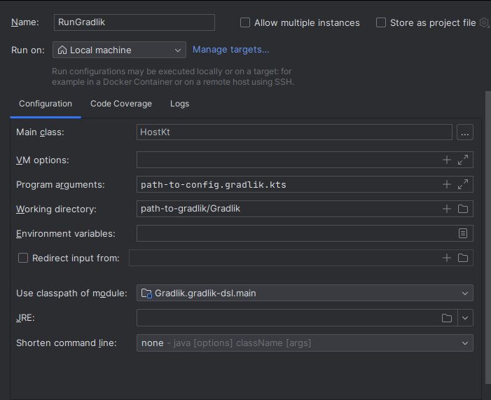

# Gradlik

Gradlik is a toy build tool that allows its users to declare various tasks using neat Gradlik-DSL and execute any desirable
Kotlin code.

## Running

### Console

To run Gradlik on a configuration file, execute the following command from the command line:

```bash
./gradlew gradlik-dsl:run --args="path-to-file/relative/to/gradlik-dsl/subdirectory"
```

For example:

```bash
./gradlew gradlik-dsl:run --args="../examples/cpp.gradlik.kts"
```

Output files will be created in the `gradlik-dsl` directory.

### Idea

However, you may want to run Gradlik from IntelliJ to control the process more comfortably and to enable syntax
highlighting in the scripts configuration files.

To do this, create new configuration for `Kotlin` with main class `HostKt` and configure it as shown on the screenshot
below:


## Configuration

To start using Gradlik you will need to create a configuration script -- a file with `gradlik.kts` extension.

Note, that for IntelliJ syntax highlighting to work correctly, this script must be able to see its base configuration
class by either being in the same module or in a module with dependency declared
as `implementation(project(':gradlik-dsl'))`. You may also need to accept some hints from IntelliJ and restart the IDE.

### Syntax

Gradlik uses Kotlin-based DSL to provide neat and comfortable syntax for project description. Its main entity is
a `task` -- a program that accepts files as inputs, executes some Kotlin code or bash commands and produces some files
as outputs.

To declare a task, simply write the following in your configuration script:

```kotlin
task("<name>") {

}
```

Inside the curly braces you will be able to configure it as you need! The following are functions that you may call
inside the task builder.

#### `dependsOn`

Declare a block of dependencies for current task. Dependency insures that this task will be executed after all its
dependencies, but their input **will not be used**.

```kotlin
task("dependent") {
    dependsOn {
        task("dependency")
    }
}
```

#### `outputs`

Declare a block of output files that are produced by this task. Files listed in this block are visible to other tasks
and will be passed to them via `inputs` section.

```kotlin
task("I love outputs") {
    outputs {
        file("notMyFile.kts")
    }
}
```

#### `inputs`

Declare a block of inputs which will be available in all executable blocks of the task. Inputs can be either `task`'s
or `file`'s: `task` inputs will create a dependency on the task and use all its `output`'s as inputs, while `file`'s
inputs will be used directly.

```kotlin
task("I love inputs") {
    inputs {
        file("myFile.kts")
        task("I love outputs")
    }
}
```

In the example above, the `"I love outputs"` task will use two files as inputs -- `myFile.kts` and `notMyFile.kts` (from
the `outputs` example) -- and it will execute strictly after the `"I love outputs"` task.

#### `runProcess`

Declare a shell command to be executed. Additional arguments can be declared via `arg` in the builder block. **All
inputs from `inputs` section will be passed to the process in the order of their declaration**.

```kotlin
task("C++ enjoyer") {
    inputs {
        file("a.cpp")
        file("b.cpp")
    }

    runProcess("g++") {
        arg("-ocpp_cool_program.out")
    }
}
```

#### `runCode`

Declare a Kotlin function to be executed. This function accepts `List<java.io.File>` as a parameter -- this is a list of
all inputs from `inputs` section in the order of their declaration.

```kotlin
task("Kotlin enthusiast") {
    runCode {
        val message = "Bazel"
        when (message) {
            "Gradle" -> println("Meow")
            "CMake" -> println("Woof")
            "Bazel" -> println("Quack")
        }
    }
}
```

A task can have multiple `run...` sections -- in this case they will be executed in the order of their declaration.

### Misc

Gradlik also provides basic checks for the contents of the project: for example, it will notify you if you declared a
cyclic dependency within your tasks or used an input that was not declared in `inputs` section.

Execution process is also verbose and will output some information as logs into stdin. To control the level of log
messages, you may refer to
this [question on StackOverflow](https://stackoverflow.com/questions/43146977/how-to-configure-kotlin-logging-logger).

### Examples

You can find some examples in `examples` module:

* `cpp.gradlik.kts`: write `cpp` source code into file via Kotlin, compile it and execute
* `cycle.gradlik.kts`: graph with cyclic dependency, which will be found during evaluation
* `diamond.gradlik.kta`: simple diamond-shaped graph
* `tree.gradlik.kts`: tree graph with node with several dependent nodes, where same files may be passed as arguments
  several times
